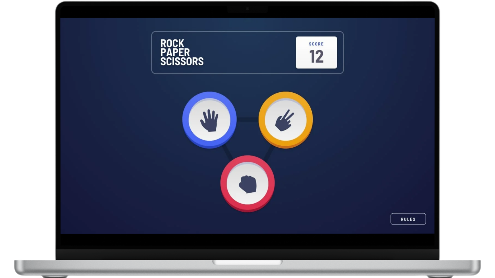

# Rock Paper Scissors - Jokenpô 

<figure>
    
</figure>

## 📝 **Sobre o Projeto**

Rock Paper Scissors - Jokenpô é um game para web onde o jogador enfrenta a "Home" em partidas de pedra, papel e tesoura. O jogador pode escolher entre as três opções clássicas, enquanto a "Home" realiza sua jogada com uma função que seleciona aleatoriamente uma das opções. O jogo inclui um contador de pontos dinâmico: ao vencer, o jogador ganha +1 ponto, e ao perder, perde -1. Para maior interatividade, foram implementados dois botões adicionais: um para reiniciar a partida e outro para exibir as regras do jogo. O design do projeto é simples e objetivo, proporcionando uma experiência funcional e intuitiva para o usuário.

[Demo do Projeto](https://jokenpo-walacemarqdev.netlify.app/) 

## 🛠️ **Tecnologias Utilizadas**

- **HTML5** para a estrutura do conteúdo.
- **CSS3** para estilização e design responsivo.
- **JavaScript** para funcionalidades dinâmicas.

## 🚀 **Recursos Principais**

- **Desenvolvido com conceito Mobile-First**: O design é otimizado para dispositivos móveis, garantindo uma experiência fluida e acessível em telas pequenas.
- **Botão de Regras**: Exibe as instruções do jogo de forma clara e objetiva.
- **Placar Dinâmico**: Atualiza automaticamente os pontos do jogador (+1 para vitórias e -1 para derrotas).
- **Botão de Reiniciar Partida**: Permite recomeçar o jogo a qualquer momento.
- **Jogadas Aleatórias para a "Home"**: Uma função escolhe automaticamente entre pedra, papel e tesoura para a "Home".
- **Escolha Livre do Jogador**: O jogador pode escolher qualquer uma das três opções clássicas: pedra, papel ou tesoura.

## 📂 **Estrutura do Projeto**

├── src 
│   ├── assets          # Imagens 
│   ├── css             # Arquivo de estilização 
│   └── js              # Arquivo de JavaScript 
├── .gitattributes      # Configurações de atributos do Git 
├── LICENSE             # Licença MIT 
├── README.md           # Documentação do projeto 
└── index.html          # Arquivo principal HTML do projeto
